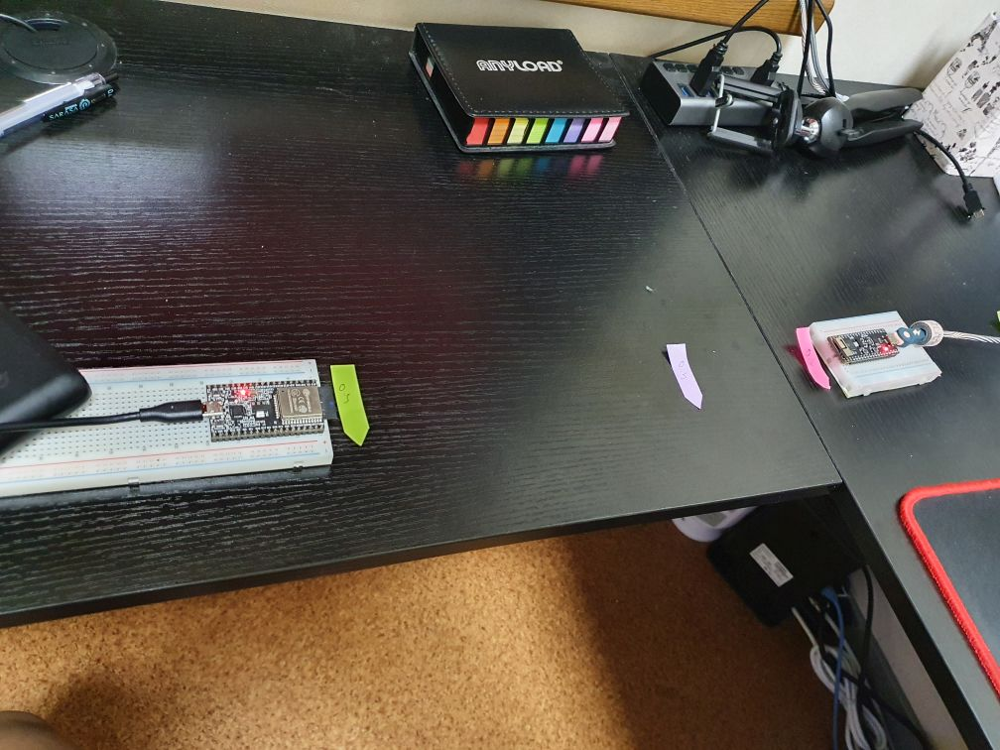
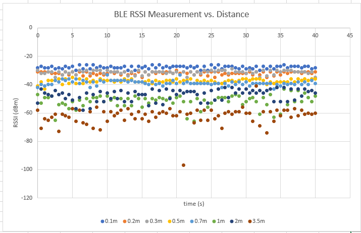

# BLE Contact Tracing Device

A contact tracing device prototype using ESP32 devices.

## Goals of this project

To help abate the spread of COVID-19, this project aims to develop a device capable of accurately detecting contact and hope to inform the user his/her risk of infection.

## Tech stack

The following materials and software are used for the development.

- ESP32 Development Board (BLE 5.0 capable)
- PlatformIO on Visual Studio Code

## Methodology

This project uses RSSI measurement between two BLE nodes to back-calculate the distance between the two. This distance information will then be use to judge contact between the persons holding the nodes/devices.

## Progress

- As of today (9/13), I managed to build the firmware for a rough prototype that demonstrates that we can extract the measured RSSI of a client device connecting to a server device, both of which are running the Bluetooth Low Energy protocol. This RSSI will be used to infer the distance between the two nodes.

- We are still not calculating the distance as we need to calibrate and fit the equation relating the RSSI and distance.

*Dirty* setup for measuring distance:

- We tried measuring some RSSI from some known distance in a fixed relative position of the boards (as shown in the photos). RSSI data is taken every 500 milliseconds for 40 seconds and graphed just to get a quick grasp of how the data would look like:

*Spurious* data:

Looking at the collected data above, as we go farther, the noisier the data gets. I neither have done a detailed analysis of the data nor diligent data collection because of physical limitations; the above data was just collected to get a grasp of the measurement variation. Data is available [here](data/distance_measurement_data.xlsx)

## Other notes and perceived challenges

- The major difference of this project from other existing mobile apps is that this aims to overcome the mismatch caused by using different Bluetooth devices (e.g. signal strength measurement between two different smartphones).
- We need to accurately collect the signal equation for converting RSSI to distance. This necessitates us to do it in a place where there are little to no external effects (e.g. an anechoic chamber). Moreover, we also need to measure and review the RSSI measurements for different permutations of the relative position of the two devices.
- How far is a "contact"? Is judging contact based on a numerical distance threshold (e.g. 1.9m or 2.1m) the right approach? Maybe we should rather use probabilistic models (machine learning?) to handle the judgment for us.
- We still haven't taken into account the effect of obstruction of the human body to the measured RSSI. Is RSSI measurement the right way to do distance measurement?
- We need an efficient way to store these information to the memory of the device.
- Need to manage power consumed by the bluetooth beacon.

## Related Projects

Just throwing out related projects and useful information here:

- [How far can you go?](http://www.davidgyoungtech.com/2020/05/15/how-far-can-you-go)
- [Covid19Radar](https://github.com/Covid-19Radar/Covid19Radar)
